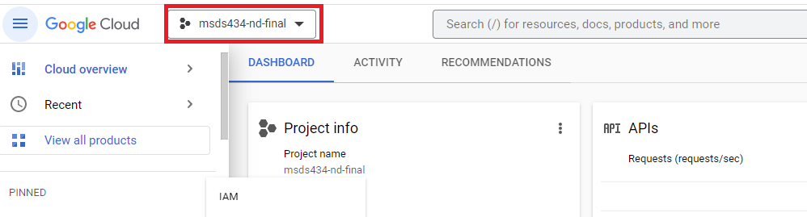
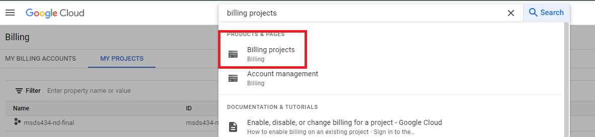
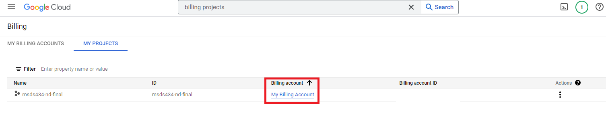
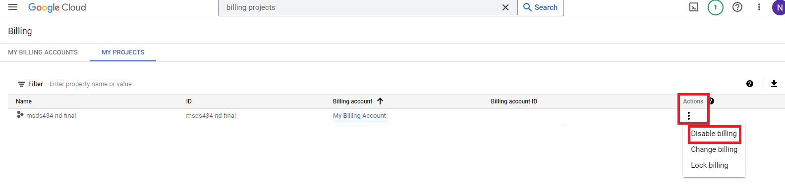
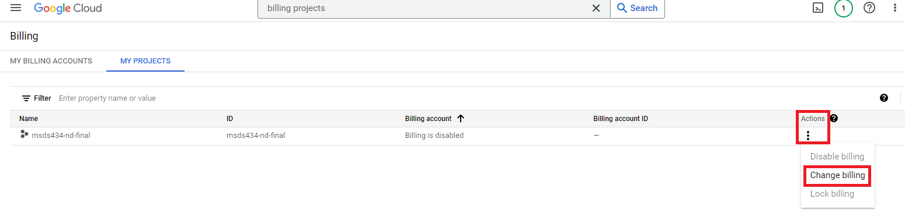
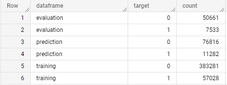
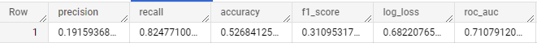
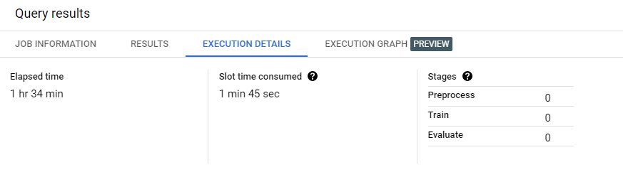
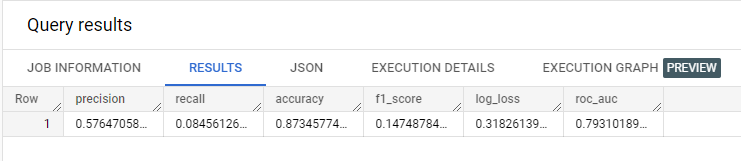

# MSDS 434 Final (Part II)
This repository contains code used for MSDS 434 Analytics Application Development Final Project (Part II). The final project consists of building a cloud-native analytics application that is hosted on the Google Cloud Platform (GCP).

## Table of Contents
  * [Introduction](#introduction)
  * [About the Data](#about-the-data)
    + [Audio Features](#audio-features)
  * [Requirements](#requirements)
  * [Architecture](#architecture)
  * [Project Details](#project-details)
    + [Step 1: Create Project in GCP](#step-1--create-project-in-gcp)
    + [Step 2: Create BigQuery Table](#step-2--create-bigquery-table)
    + [Step 3: Gather the data and load it into GCP](#step-3--gather-the-data-and-load-it-into-gcp)
    + [Step 4: Create training, evaluation, and prediction sets](#step-4--create-training--evaluation--and-prediction-sets)
    + [Step 5: Build Machine Learning Model in BigQuery](#step-5--build-machine-learning-model-in-bigquery)
  * [Project Limitations](#project-limitations)
  * [Future Enhancements](#future-enhancements)
  * [Repository Info](#repository-info)

## Introduction
As an avid user of Spotify (averaging about 80,000 listening minutes per year), I am always impressed by their large variety of music and their recommendation algorithm to create a perfect customized playlist just for me. With Spotify providing access to over 100 million tracks, I wanted to dig deeper to figure out what makes a track popular and how they end up in my playlists. To do this, I will be taking a deeper look in Spotify’s track data and will build a machine learning model to see if I can predict if a track will be a bop or a flop based off of its audio features.


## About the Data
The Spotify track data set for this project was pulled [from Kaggle](https://www.kaggle.com/datasets/lehaknarnauli/spotify-datasets?select=tracks.csv) and it had over 580,000 unique tracks and their audio features.

### Audio Features
Details are from [Spotify's API Dcoumentation](https://developer.spotify.com/documentation/web-api/reference/#/operations/get-several-audio-features)

| Name             | Data Type     | Definition    |
| ---------------- | ------------- | ------------- |
| id               | string        | The Spotify ID for the track|
| name             | string        | Track name|
| popularity       | int           | The popularity of the artist. The value will be between 0 and 100, with 100 being the most popular. The artist's popularity is calculated from the popularity of all the artist's tracks|
| duration_ms      | int           |The duration of the track in milliseconds|
| explicit         | boolean       | Whether or not the track has explicit lyrics ( true = yes it does; false = no it does not OR unknown)|
| id_artists       | string        | The Spotify ID for the artist|
| release_date     | string        | The date the track was first released|
| danceability     | float         | Danceability describes how suitable a track is for dancing based on a combination of musical elements including tempo, rhythm stability, beat strength, and overall regularity. A value of 0.0 is least danceable and 1.0 is most danceable|
| energy           | float         | Energy is a measure from 0.0 to 1.0 and represents a perceptual measure of intensity and activity. Typically, energetic tracks feel fast, loud, and noisy. For example, death metal has high energy, while a Bach prelude scores low on the scale. Perceptual features contributing to this attribute include dynamic range, perceived loudness, timbre, onset rate, and general entropy|
| key              | int           | The key the track is in. Integers map to pitches using standard Pitch Class notation. E.g. 0 = C, 1 = C♯/D♭, 2 = D, and so on. If no key was detected, the value is -1|
| loudness         | float         | The overall loudness of a track in decibels (dB). Loudness values are averaged across the entire track and are useful for comparing relative loudness of tracks. Loudness is the quality of a sound that is the primary psychological correlate of physical strength (amplitude). Values typically range between -60 and 0 db|
| speechiness      | float         | Speechiness detects the presence of spoken words in a track. The more exclusively speech-like the recording (e.g. talk show, audio book, poetry), the closer to 1.0 the attribute value. Values above 0.66 describe tracks that are probably made entirely of spoken words. Values between 0.33 and 0.66 describe tracks that may contain both music and speech, either in sections or layered, including such cases as rap music. Values below 0.33 most likely represent music and other non-speech-like tracks|
| acousticness     | float         | A confidence measure from 0.0 to 1.0 of whether the track is acoustic. 1.0 represents high confidence the track is acoustic|
| instrumentalness | float         | Predicts whether a track contains no vocals. "Ooh" and "aah" sounds are treated as instrumental in this context. Rap or spoken word tracks are clearly "vocal". The closer the instrumentalness value is to 1.0, the greater likelihood the track contains no vocal content. Values above 0.5 are intended to represent instrumental tracks, but confidence is higher as the value approaches 1.0|
| liveness         | float         | Detects the presence of an audience in the recording. Higher liveness values represent an increased probability that the track was performed live. A value above 0.8 provides strong likelihood that the track is live|
| valence          | float         | A measure from 0.0 to 1.0 describing the musical positiveness conveyed by a track. Tracks with high valence sound more positive (e.g. happy, cheerful, euphoric), while tracks with low valence sound more negative (e.g. sad, depressed, angry)|
| tempo            | float         | The overall estimated tempo of a track in beats per minute (BPM). In musical terminology, tempo is the speed or pace of a given piece and derives directly from the average beat duration|
| time_signature   | int           | An estimated time signature. The time signature (meter) is a notational convention to specify how many beats are in each bar (or measure). The time signature ranges from 3 to 7 indicating time signatures of "3/4", to "7/4"|

## Requirements
- Access to [Google Cloud Platform (GCP)](https://cloud.google.com/)
- If using Python to download the Kaggle data set, a [Kaggle API Key](https://www.kaggle.com/docs/api) is needed.
    - Make sure to save the API key in 'C:\Users\USER_NAME\.kaggle' directory.

## Architecture

## Project Details
For this project, we will be building an end-to-end process of gathering, preparing data for Machine Learning (ML) modeling using GCP, BigQueryg, and Python.

### Step 1: Create Project in GCP
The project I created is called 'msds434-nd-final'. You can viw your project(s) in GCP by clicking on the project box in the top left hand corner of the screen.



Make sure that you have a billing account connected to the project. To check you billing account(s) that are connected to your project, search "billing projects" in the search box and click on the first option.



It should then take you to the billing portal and you can view your projects and what billing account is connected.



**IMPORTANT: MAKE SURE TO UNLINK YOUR BILLING ACCOUNT FROM YOUR PROJECT WHEN YOU ARE NO LONGER USING IT**

GCP and AWS can't charge you if they don't have a credit card linked to the project. It is best practice to unlink your credit card once you're done working in a project in the cloud as you do not want to accrue additional charges for resources that you are not necessarily using consciously. Note that you will need to relink your account back to the project if you plan on using it again.

To **unlink your account** from your project in GCP, go to "billing projects" and click the three dots under the 'Actions' columns. Then click 'Disable billing'. 



To **relink your account** to your project in GCP, you will do the same process as above, but click 'Change billing' and select the billing account you would like to link with you project.



### Step 2: Create BigQuery Table
1. In your GCP project, navagate to BigQuery. This will be our Data Lake that we will store the Spotify track data and the place we create a basic machine learning model using the ata.
2. Create a new data set.
    - Next to your project name, click the three dots and click 'Create dataset'.
    - My dataset name is 'spotify_track_data'.

### Step 3: Gather the data and load it into GCP
In [my Jupyter Notebook](https://github.com/DrakeData/MSDS434-Final_P2/blob/main/01-DataGathering.ipynb), I used the [Kaggle API](https://www.kaggle.com/docs/api) to pull the track CSV file using Python. You can do the same or you can export the data set directly [from Kaggle](https://www.kaggle.com/datasets/lehaknarnauli/spotify-datasets?select=tracks.csv) and load it into BigQuery manually.

Code notes:
- I performed very basic Exploratory Data Analysis (EDA) and noticed that there was a high correlation with danceability, energy and loudness when it comes down to track popularity. There was also a strong negative correlation with acousticness and track popularity.
- I dropped all Nulls within the 'name' column.
- I created a new column called 'bop_or_flop', where if a track's popularity is greater than or equal to 50, then it is a bop (1), else it is a flop (0).
- Using [pandas_gbq](https://pandas-gbq.readthedocs.io/en/latest/), I directly loaded my Pandas Data Frame into my BigQuery dataset.
    - table name is 'track_main'

### Step 4: Create training, evaluation, and prediction sets
To build and test a Machine Learning (ML) model, we first need to create a training, evaluation, and prediction sets. I ended up doing this in BigQuery in which I created a new table called 'track_tab' and used logic to to split_field and create a new column called 'dataframe' to identify my  training, evaluation, and prediction sets. My 'target' column is my original 'bop_or_flop' column; I called it 'target' here to make it easier to make the ML model.

**Code used to build table:**
```
CREATE OR REPLACE TABLE `spotify_track_data.track_tab` AS
SELECT duration_ms
    , energy
    , danceability
    , loudness
    , speechiness
    , acousticness
    , instrumentalness
    , liveness
    , valence
    , tempo
    , time_signature
    , target,
CASE
  WHEN split_field < 0.8 THEN 'training'
  WHEN split_field = 0.8 THEN 'evaluation'
  WHEN split_field > 0.8 THEN 'prediction'
 END AS dataframe
from (
  SELECT duration_ms
    , energy
    , danceability
    , loudness
    , speechiness
    , acousticness
    , instrumentalness
    , liveness
    , valence
    , tempo
    , time_signature
    , bop_or_flop AS target
    , ROUND(ABS(RAND()), 1) AS split_field
  FROM `spotify_track_data.track_main`
);
```

**Code used to evaluate table:**
```
SELECT dataframe
    , target
    , count(*) AS count
FROM `spotify_track_data.track_tab`
GROUP BY dataframe, target
ORDER BY dataframe
;
```

**Output:**



### Step 5: Build Machine Learning Model in BigQuery
One perk of using BigQuery as your database is that you can use ML techniques directly within it. This functions makes ML easily assessable and is ready to go right out of the box. There is also a low barrier of entry since the only language you need to know to use ML in BigQuery is SQL.

For my ML model, I used logistic regression to try to predict if a track is a bop (1) or a flow (0).

**Code used to build model**
```
-- #### CREATE MODEL ####
CREATE or REPLACE MODEL `spotify_track_data.bopflop_model`
OPTIONS(model_type='logistic_reg',
      auto_class_weights=TRUE,
      input_label_cols=['target']
      ) AS
SELECT *
  EXCEPT(dataframe)
FROM  `msds434-nd-final.spotify_track_data.track_tab`
WHERE dataframe = 'training'
;
```
The model took a couple minutes to run; now let's evaluate how it did.

**Code used to evaluate model:**
```
-- EVALUATE
SELECT *
FROM ML.EVALUATE(MODEL `spotify_track_data.bopflop_model`,
  (
    SELECT *
    FROM `msds434-nd-final.spotify_track_data.track_tab`
    WHERE dataframe = 'evaluation'
  )
);
```
**Output:**



As you can see, my model has a low accuracy score of 52.7% and a high recall score (82.5%) and low precision score (19.2%). I suspect that this is because I did not do any feature engineering on the data set and ultimatly just ran it as is. In the future, I would dig deeper into the data set to perform feature engineering.

**Code used to make prediction:**
```
SELECT *
FROM ML.PREDICT(MODEL `spotify_track_data.bopflop_model`,
  (
    SELECT *
    FROM `msds434-nd-final.spotify_track_data.track_tab`
    WHERE dataframe = 'prediction'
  )
);
```

To view more model information, you can run these queries:
```
-- #### MODEL INFO ####
-- Training info  
SELECT *
FROM ML.TRAINING_INFO(MODEL `spotify_track_data.bopflop_model`)


-- Feature info
SELECT *
FROM ML.FEATURE_INFO(MODEL `spotify_track_data.bopflop_model`)


-- Check model weight
SELECT *
FROM ML.WEIGHTS(MODEL `spotify_track_data.bopflop_model`)
```

Another option is to run the dataset through AutoML. A benifit of using AutoML is that it lowers the cost of ownership (TCO) in a couple different ways, one way is that it automates feature engineering, which transforming data into features that better represent the underlying problem. AutoML also comes out-of-the-box with security and compliance built into it. It does take more time, money, and resources though to run AutoML, so that is something to keep in mind.

Since my training dataset had about 40,000 veriables, I decided to run AutoML to see if I can build a better model.

**Code used to build model:**
```
-- #### CREATE AUTOML MODEL ####
CREATE or REPLACE MODEL `spotify_track_data.bopflop_AutoML`
OPTIONS(model_type='AUTOML_CLASSIFIER',
      input_label_cols=['target'],
      OPTIMIZATION_OBJECTIVE = 'MAXIMIZE_AU_ROC'
      ) AS
SELECT *
  EXCEPT(dataframe)
FROM  `msds434-nd-final.spotify_track_data.track_tab`
WHERE dataframe = 'training'
;
```
The model took 1 hour and 34 minutes to run and cost about $7 to run [look into cost].



Time to evaluate the AutoML model

**Code used to evaluate AutoML model:**
```
-- EVALUATE
SELECT *
FROM ML.EVALUATE(MODEL `spotify_track_data.bopflop_AutoML`,
  (
    SELECT *
    FROM `msds434-nd-final.spotify_track_data.track_tab`
    WHERE dataframe = 'evaluation'
  )
);
```
**Output:**


As you can see, the AutoML model performed much better than my original model with a 87.3% accuracy score, 57.6% precision score and 8.5% recall score. Needless to say, I will be using this model.

**Code used to make prediction:**
```
SELECT *
FROM ML.PREDICT(MODEL `spotify_track_data.bopflop_AutoML`,
  (
    SELECT *
    FROM `msds434-nd-final.spotify_track_data.track_tab`
    WHERE dataframe = 'prediction'
  )
);
```

### Step 6: Deploy frontend application

##

## Project Limitations

## Future Enhancements

## Repository Info
Created by: [Nicholas Drake](https://github.com/DrakeData)

Created Date: 03/06/2023
